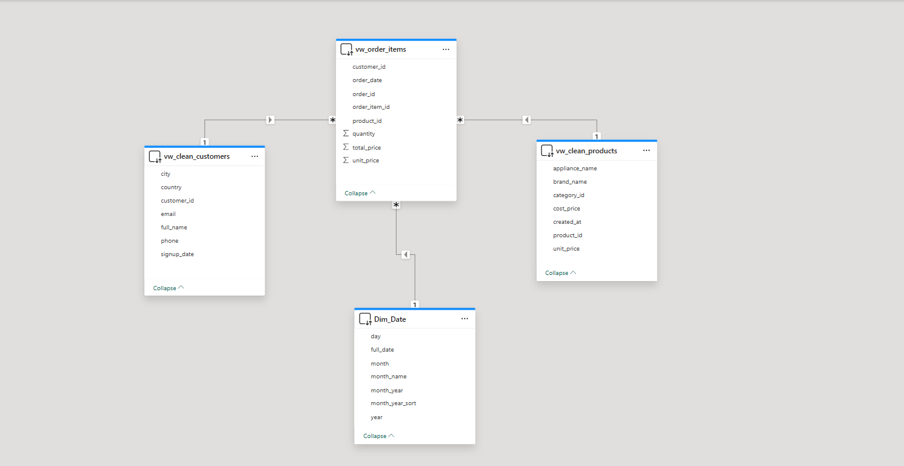
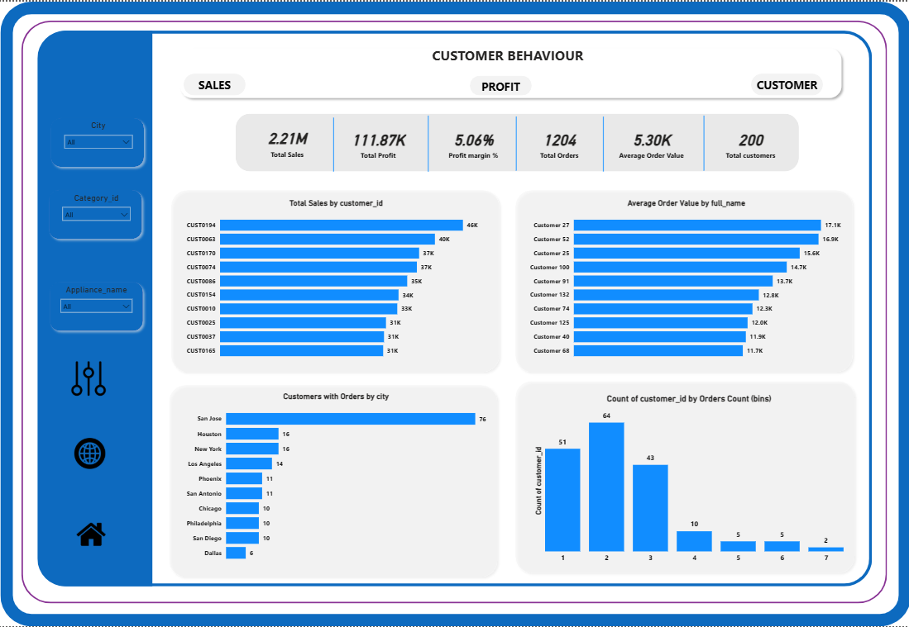
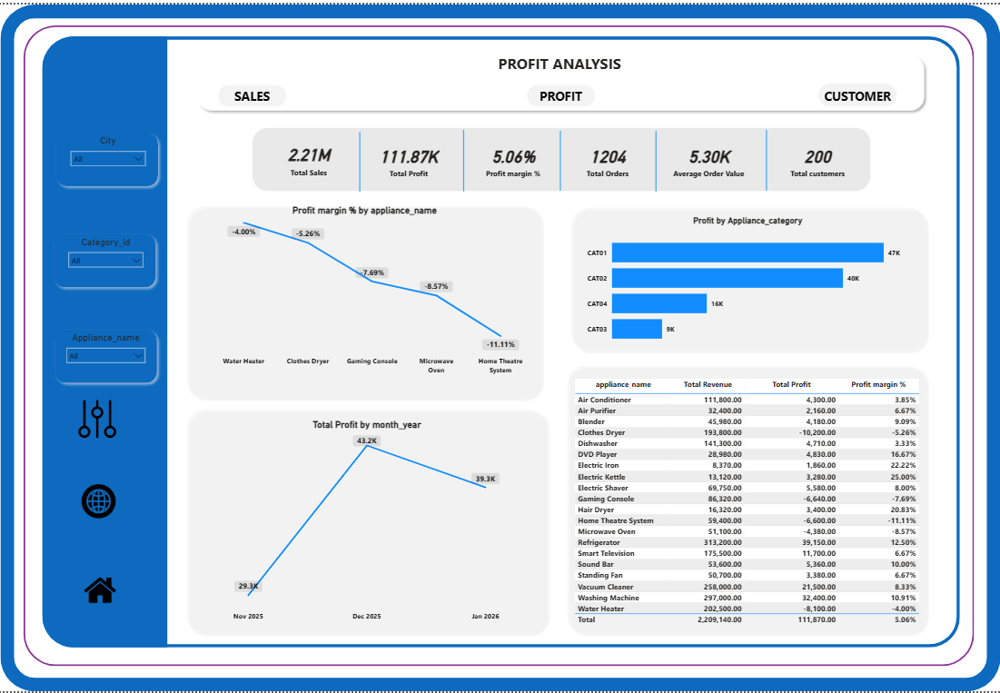
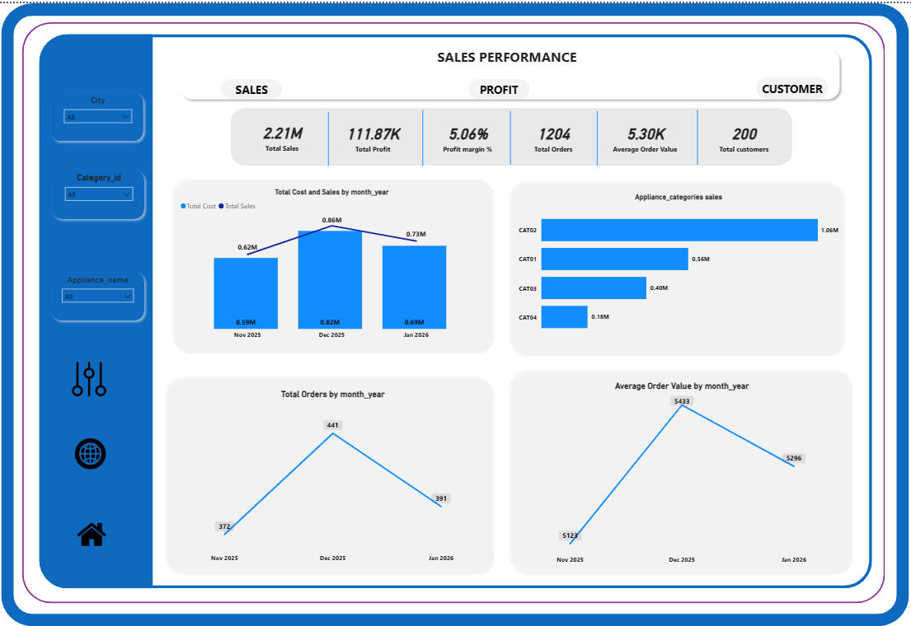

## 📦 E-Commerce Startup Data Warehouse & Power BI Analytics Project

---

## 📌 Project Overview

This project simulates a startup e-commerce business built using SQL Server and analyzed in Power BI.

The database was designed using a Star Schema architecture, incorporating fact and dimension tables, data validation constraints, reporting views, and interactive dashboards.

The goal was to build an end-to-end data system that supports business intelligence, performance tracking, and decision-making for a growing e-commerce company.

--

## 🎯 Objective (Power BI Dashboard)

Objective:
To analyse sales performance, product profitability, and customer purchasing behaviour for an e-commerce startup by building an interactive Power BI dashboard that reveals where revenue is generated, where losses occur, and how customers contribute to business growth.

--

## 📊 Summary of Findings

This report features business records across a period of 3 months (Nov 2025 – Dec 2026), covering different appliance products and categories across 10 cities in the USA.

Total Sales: 2.21M

Total Cost: 2.10M

Total Profit: 111.87K

Profit Margin: 5.06%

Total Customers in Database: 200

Distinct Customers Who Made Orders: 180

Total Orders: 1,204

Total Items Sold: 3,590

Average Order Value: 5.30K

The business generated strong revenue; however, the narrow gap between total cost and sales resulted in a relatively low profit margin.

---

## 🏗️ Database Design

The database follows a Star Schema structure, consisting of:

🔹 Dimension Tables

customers

products

Dim_Date

appliance_categories

🔹 Fact Tables

orders

order_items

🔹 Reporting Views

vw_order_items

vw_clean_products

view_inventory

This structure ensures scalability, optimized reporting, and efficient analytical performance in Power BI.

---

## 📁 Repository Structure
```
ecommerce-data-warehouse-project/
│
├── README.md
│
├── database/
│   ├── 01_create_tables.sql
│   ├── 02_insert_sample_data.sql
│   ├── 03_create_views.sql
│
├── Images/
│   ├── ecommerce.PNG
│   ├── customer_behaviour.PNG
│   ├── profit_analysis.PNG
│   ├── sales_performance.PNG
│
│
└── Power bi/
    ├── E_commerce.pbix
 ```  

---

## 🔐 Data Quality & Constraints

To ensure data integrity, the following were implemented:

Primary Keys (PK)

Foreign Keys (FK)

UNIQUE constraints

CHECK constraints

NOT NULL constraints

Email validation

Logical price validation (cost ≤ unit price)

This ensures clean, reliable data for analysis.

---

## 📈 Power BI Integration

Connected to SQL Server database

Used clean reporting views

Implemented DirectQuery/Import mode

Built interactive dashboards

Created a dedicated measures table for DAX calculations

---

## 🧮 DAX Measures Created

---

   ```
Total Revenue = SUM(vw_order_items[total_price])

Total Sales = SUM(vw_order_items[total_price])

Total Profit = [Total Sales] - [Total Cost]

Total Cost =
SUMX(
    vw_order_items,
    vw_order_items[quantity] * RELATED(vw_clean_products[cost_price])
)

Profit margin % = [Total Profit] / [Total Sales]

Total quantity = SUM(vw_order_items[quantity])

Total Orders = COUNT(vw_order_items[order_id])

Distinct Orders = DISTINCTCOUNT(vw_order_items[order_id])

Customers with Orders = DISTINCTCOUNT(vw_order_items[customer_id])

Total customers = DISTINCTCOUNT(customers[customer_id])

Total products = DISTINCTCOUNT(products[product_id])

Average Order Value = DIVIDE([Total Sales], [Distinct Orders])
```

---

## 📊 Dashboard Preview  

### 1️⃣ Star Schema


---

### 2️⃣ Customer Behaviour


---

### 3️⃣ Profit Analysis  


---

### 3️⃣ Sales Performance


---

## Insight
— Seasonal Sales Spike
December recorded the highest sales, total orders, average order value, and total profit, showing strong seasonal buying behaviour compared to November and January.
— Revenue vs Profit Difference
Home appliances generated the highest revenue (1.06M), but Kitchen appliances generated the highest profit (47K), showing that high sales volume does not always translate into high profitability.
— Loss-Making Products
Five appliances (Home theatre, Microwave oven, Gaming console, Clothe dryer, Water heater) are operating at negative profit margins, meaning they cost more than they generate in revenue.
— Profit Driven by Customer Spending Behaviour
The increase in profit in December was driven by higher order volume and higher average order value, not price increases.
— Low Customer Retention
The majority of customers place only 1–3 orders, indicating reliance on one-time or low-frequency buyers.
— Uneven Customer Distribution by City
Active purchasing customers are unevenly distributed across cities, with some locations contributing fewer active buyers than others.
— Customer Conversion Gap
Out of 200 registered customers, only 180 have placed orders, meaning 10% remain inactive. This indicates an untapped revenue opportunity within the existing customer base.

---

## Recommendation
— Seasonal Planning Strategy
Treat December as a peak season and develop separate inventory, sales, and marketing forecasts for peak and non-peak months to avoid overstocking and budgeting errors.
— Profit-Focused Marketing
Increase promotional focus on Kitchen appliances since they generate stronger profit margins despite lower revenue than Home appliances.
— Address Loss-Making Products
Review pricing strategies, renegotiate supplier costs, or bundle loss-making products with profitable items to prevent further erosion of overall profit.
— Encourage Higher Spending Per Order
Introduce bundle offers, upselling strategies, and promotional incentives to maintain higher average order values throughout the year.
— Improve Customer Retention
Implement loyalty programs, repeat-purchase discounts, and targeted follow-up campaigns to increase customer lifetime value.
— Target Underperforming Cities
Run localized marketing campaigns and promotions in lower-performing cities to improve customer engagement and balance revenue distribution.
— Improve Customer Activation
Launch targeted promotions and onboarding incentives to convert inactive customers into active buyers and increase overall revenue.

---

## 🛠️ Technologies Used

SQL Server

Star Schema Modeling

Data Constraints & Views

Power BI

DAX

DirectQuery/Import Mode

Business Intelligence Design

---

## 📌 Conclusion

This project successfully demonstrates the end-to-end development of a structured e-commerce data warehouse using SQL Server and a star schema architecture, 
integrated with Power BI to deliver actionable business insights on sales performance, profitability, and customer behavior, while showcasing strong capabilities in 
data modeling, SQL querying, DAX calculations, and business intelligence reporting.

